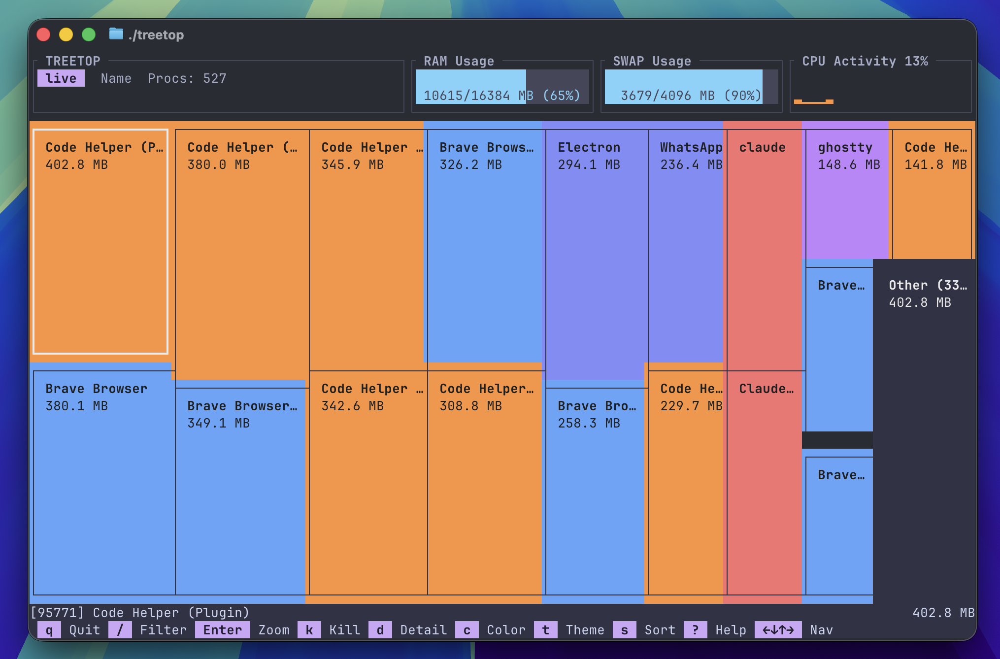

# TreeTop CLI




`treetop` is a cross-platform terminal UI process monitor that visualizes memory usage as an interactive treemap.

## Features

- Linux/macOS/Windows support
- Treemap-based process visualization
- Sort modes: memory, cpu, name
- Filtering, zoom in/out, and process detail panel
- Multiple color modes (name, memory, cpu, user, group, mono)
- Theme cycling (vivid, pastel, light)
- Config file support (`~/.config/treetop/config.toml`)
- Customizable keybinds with in-app help overlay (`?`)
- Optional perf tracing instrumentation and headless perf capture

## Install

### From source

```bash
cargo install --path .
```

### Build release binary

```bash
cargo build --release
```

## Usage

```bash
treetop
```

Show help:

```bash
treetop --help
```

Common options:

```bash
# refresh every second
treetop --refresh-rate 1000

# load custom config file
treetop --config ./config.toml

# force color support mode
treetop --color truecolor

# use categorical process-name coloring
treetop --color-mode name
```

Perf capture mode (headless, requires `perf-tracing` feature):

```bash
cargo run --features perf-tracing -- --perf-capture

# tune capture run
cargo run --features perf-tracing -- \
	--perf-capture \
	--perf-iterations 300 \
	--perf-width 200 \
	--perf-height 60 \
	--perf-output target/perf/perf_spans.jsonl
```

## Controls

Default keybinds:

- `q`: quit
- `/`: filter mode
- `k` / `K`: kill / force kill selected process
- `c`: cycle color mode
- `t`: cycle theme
- `d`: toggle detail panel
- `s`: cycle sort mode (memory/cpu/name)
- `Enter` / `Esc`: zoom in / zoom out
- `r`: refresh data
- `?`: toggle help overlay
- `↑↓←→`: navigate
- `Ctrl+C`: always quit

## Configuration

`treetop` loads config from `~/.config/treetop/config.toml` by default (or from `--config <PATH>`).

```toml
[general]
refresh_rate_ms = 2000
default_color_mode = "name"      # name | memory | cpu | user | group | mono
show_detail_panel = false
sparkline_length = 60
color_support = "auto"           # auto | truecolor | 256 | mono
default_sort = "memory"          # memory | cpu | name

[treemap]
min_rect_width = 6
min_rect_height = 2
group_threshold = 0.01
max_visible_procs = 25
border_style = "thin"            # thin | thick | none
animation_frames = 5

[colors]
theme = "vivid"                  # vivid | pastel | light
heat_low = "#475569"
heat_mid = "#f97316"
heat_high = "#ec4899"

[keybinds]
quit = "q"
filter = "/"
kill = "k"
force_kill = "K"
cycle_color = "c"
cycle_theme = "t"
toggle_detail = "d"
zoom_in = "Enter"
zoom_out = "Esc"
help = "?"
cycle_sort = "s"
refresh = "r"
```

## Development

```bash
cargo fmt -- --check
cargo clippy --all-targets --all-features -- -D warnings
cargo test --all-targets
```

Additional docs:

- Release notes: `docs/RELEASE_NOTES_v0.2.md`
- Changelog: `docs/CHANGELOG.md`

## License

MIT. See `LICENSE`.
